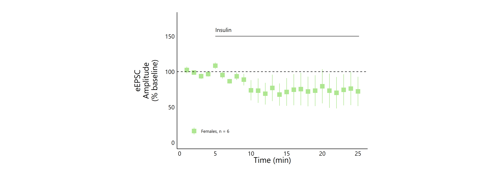
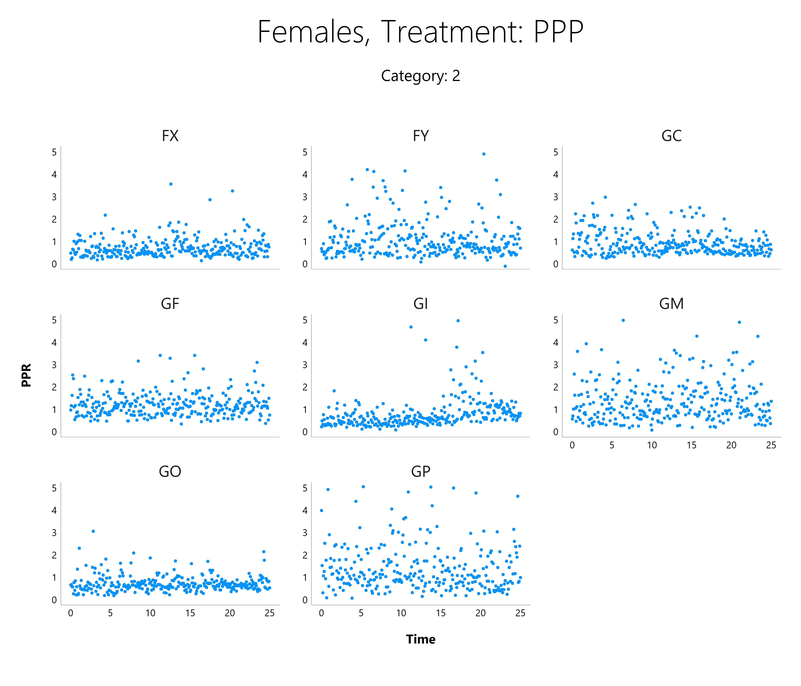

Quick Plot Viewer
================
Christelinda Laureijs
April 16, 2024

<!-- plot tester -->
<!-- AO or CO could be an option -->
<!-- AZ + BN both look nice, but there is little difference between conditions -->
<!-- I chose CO because the visual difference between treatments was clearer. -->

# eEPSCs after Adding Insulin

## Control

<!-- --><!-- -->

### Males

#### Raw

<!-- -->

#### Pruned

<!-- -->

#### PPR

<!-- -->

### Females

#### Raw

<!-- -->

#### Pruned

<!-- -->

#### PPR

<!-- -->

## HNMPA

<!-- -->

### Males

#### Raw

<!-- -->

#### Pruned

<!-- -->

#### PPR

<!-- -->

### Females

#### Raw

<!-- -->

#### Pruned

<!-- -->

#### PPR

<!-- -->

## Fasting

<!-- -->

### Males

#### Raw

<!-- -->

#### Pruned

<!-- -->

#### PPR

<!-- -->

### Females

#### Raw

<!-- -->

#### Pruned

<!-- -->

#### PPR

<!-- -->

## PPP

<!-- -->

### Females

#### Raw

<!-- -->

#### Pruned

<!-- -->

#### PPR

<!-- -->

### Males

#### Raw

<!-- -->

#### Pruned

<!-- -->

#### PPR

<!-- -->
